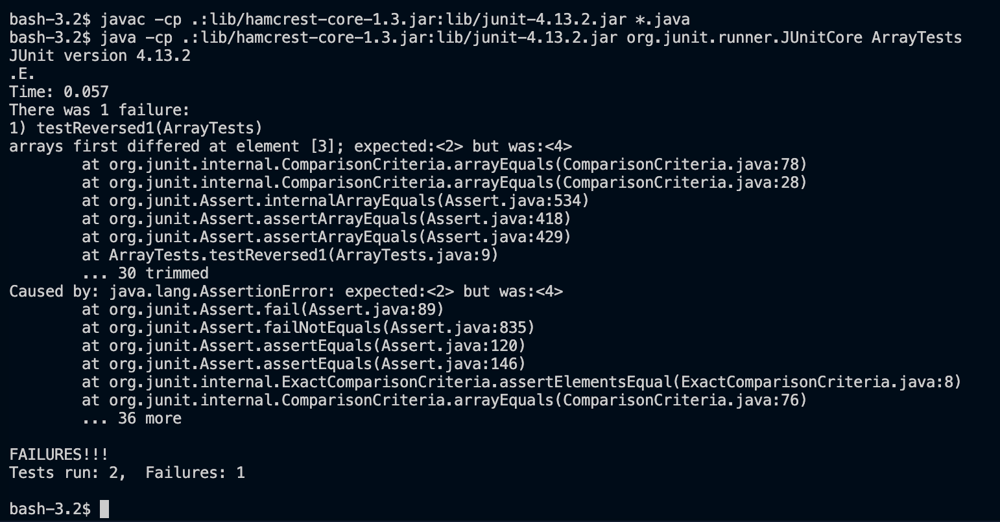

# Lab Report 3 - Bugs and Commands

## Part 1: Bugs
For this lab, I explored the bug found in `reverseInPlace()` method, found in `ArrayExamples.java`. 

1. Failure-inducing input
This failed JUnit test is run in `ArrayExamplesTest.java` to test the method.
```
@Test
public void testReversed1() {
    int[] input1 = {1,2,3,4,5};
    assertArrayEquals(new int[]{5,4,3,2,1}, reversed1);
}
```

2. Suceeding input
This successful JUnit test is run in `ArrayExamplesTest.java` to test the method.
```
@Test
public void testReversed2() {
    int[] input1 = {1};
    assertArrayEquals(new int[]{1}, reversed1);
}
```

3. Symptoms


4. Bug
The code before:
```
public class ArrayExamples {
  static void reverseInPlace(int[] arr) {
    for(int i = 0; i < arr.length; i += 1) {
      arr[i] = arr[arr.length - i - 1];
    }
  }
}
```

The code after:
```
public class ArrayExamples {
  static void reverseInPlace(int[] arr) {
    for(int i = 0; i < arr.length / 2; i += 1) {
      int temp = arr[i];
      arr[i] = arr[arr.length - i - 1];
      arr[arr.length - i - 1] = temp;
    }
  }
}
```

Explanation: 
This error occurs because simply swapping values directly deletes the value that is overwritten first. Also, looping through the full array causes the overwritten values to show up twice. This can be fixed by looping through just half the array. Also, the value that is initially overwritten can be stored in a temporary variable and then added back.