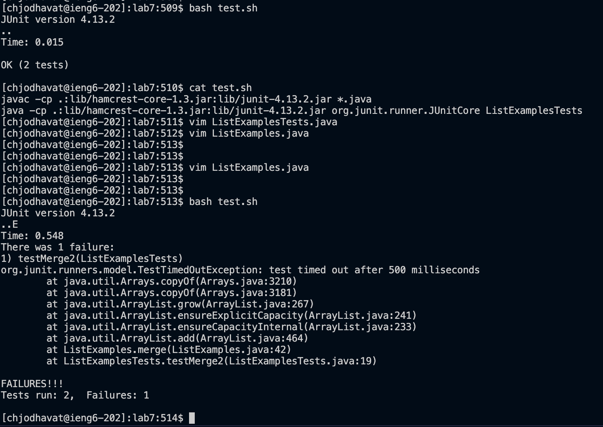
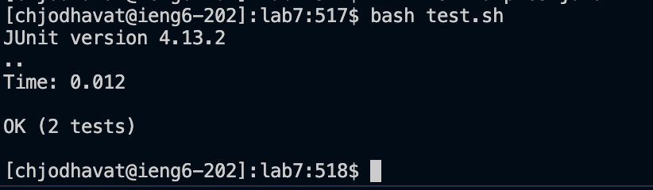

# Lab Report 5: Putting it All Together

## Part 1 - Debugging Scenario

This lab report emulates a debugging scenario used to show the debugging proceess done by a student and a TA. For this lab report, I will use the Bash script run to test the JUnit tests from Week 7's lab report. The entire setup with all the screenshots can be found in Step 4.

1. Student Post: My JUnit test is failing. The bug symptom can be seen in the screenshot below. Based on the output from the JUnit test, I think that the error is occuring in `testMerge2`, which can be found at Line 19 of `ListExamplesTest.java`. Also using the JUnit output, the error is caused as a result of Line 42 in `ListExamples.java`.


2. TA Response: Based on your guess that the error is in Line 42 of `ListExamples.java`, where do you think the error is occurring. Think about what Line 42 is supposed to do in relation to the `testMerge2` method. Can you notice something wrong the variables used in that line?

3. Student Response: I tried changing the variable from `index1` to `index2` because the while loop at Line 39 runs over the size of `index2`. I ran the `bash` script again and got this output. All the JUnit tests correctly passed.


4. Setup for the scenario:

- Directory structure:
```
\lab 7
    \ListExamples.class
    \ListExamples.java
    \ListExamplesTest.java
    \ListExamplesTest.class
    \StringChecker.class
    \test.sh
```

- Contents of all the scripts before fixing the bugs:

`ListExamples.java`
```
import java.util.ArrayList;
import java.util.List;

interface StringChecker { boolean checkString(String s); }

class ListExamples {

  // Returns a new list that has all the elements of the input list for which
  // the StringChecker returns true, and not the elements that return false, in
  // the same order they appeared in the input list;
  static List<String> filter(List<String> list, StringChecker sc) {
    List<String> result = new ArrayList<>();
    for(String s: list) {
      if(sc.checkString(s)) {
        result.add(0, s);
      }
    }
    return result;
  }


  // Takes two sorted list of strings (so "a" appears before "b" and so on),
  // and return a new list that has all the strings in both list in sorted order.
  static List<String> merge(List<String> list1, List<String> list2) {
    List<String> result = new ArrayList<>();
    int index1 = 0, index2 = 0;
    while(index1 < list1.size() && index2 < list2.size()) {
      if(list1.get(index1).compareTo(list2.get(index2)) < 0) {
        result.add(list1.get(index1));
        index1 += 1;
      }
      else {
        result.add(list2.get(index2));
        index2 += 1;
      }
    }
    while(index1 < list1.size()) {
      result.add(list1.get(index1));
      index1 += 1;
    }
    while(index2 < list2.size()) {
      result.add(list2.get(index2));
      // change index1 below to index2 to fix test
      index1 += 1;
    }
    return result;
  }


}
```

`ListExamplesTest.java`
```
import static org.junit.Assert.*;
import org.junit.*;
import java.util.*;
import java.util.ArrayList;


public class ListExamplesTests {
        @Test(timeout = 500)
        public void testMerge1() {
                List<String> l1 = new ArrayList<String>(Arrays.asList("x", "y"));
                List<String> l2 = new ArrayList<String>(Arrays.asList("a", "b"));
                assertArrayEquals(new String[]{ "a", "b", "x", "y"}, ListExamples.merge(l1, l2).toArray());
        }

        @Test(timeout = 500)
        public void testMerge2() {
                List<String> l1 = new ArrayList<String>(Arrays.asList("a", "b", "c"));
                List<String> l2 = new ArrayList<String>(Arrays.asList("c", "d", "e"));
                assertArrayEquals(new String[]{ "a", "b", "c", "c", "d", "e" }, ListExamples.merge(l1, l2).toArray());
        }

}
```

`test.sh`
```
javac -cp .:lib/hamcrest-core-1.3.jar:lib/junit-4.13.2.jar *.java
java -cp .:lib/hamcrest-core-1.3.jar:lib/junit-4.13.2.jar org.junit.runner.JUnitCore ListExamplesTests
```

- Command ran to trigger the bug:
`bash test.sh`

- Description on how to fix the bug:
Edit line 42 in `ListExamples.java` to change the variable's name from `index1` to `index2`.
```
// before: index1 += 1
// after: index2 += 1
```


